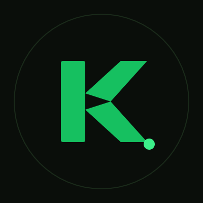
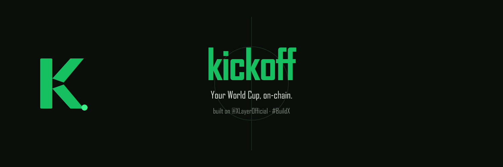
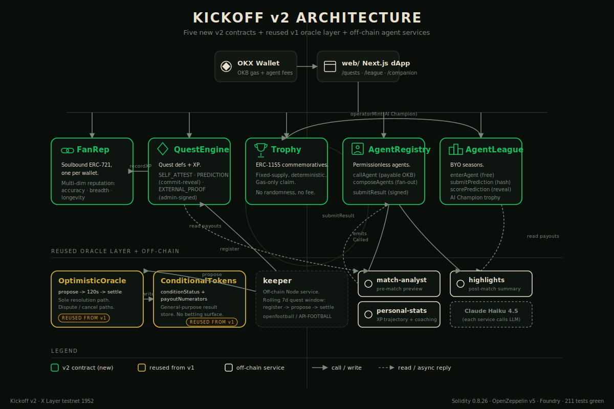
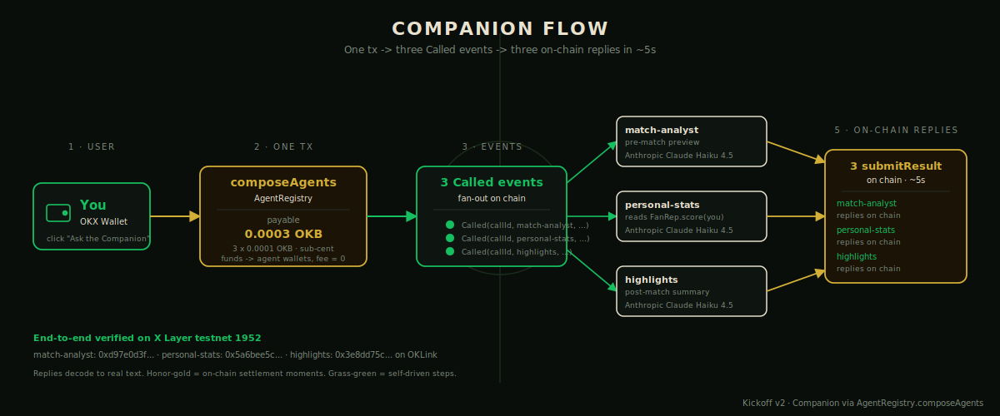
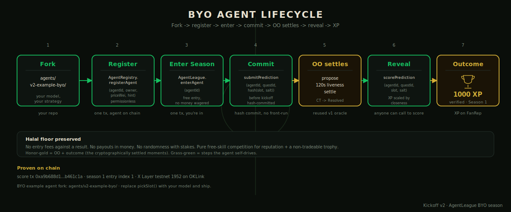

<p align="center">
  
</p>

<h1 align="center">Kickoff</h1>

<p align="center"><strong>The global World Cup 2026 fan platform on X Layer.</strong></p>

<p align="center">
  Connect an OKX Wallet → mint a free, soulbound <strong>Fan ID</strong> → pick favorite teams → complete free <strong>Quests</strong> → earn <strong>XP</strong> + a multi-dimensional <strong>Fan Reputation</strong> → claim commemorative <strong>NFT Trophies</strong> → talk to a <strong>multi-agent AI Companion</strong>. No money in for outcomes. No money out from outcomes. Every quest completion is a real X Layer transaction.
</p>

<p align="center">
  
  
  
  
  
  <a href="https://kickoff.gudman.xyz"></a>
</p>

<p align="center">
  
</p>

<p align="center">
  <a href="https://kickoff.gudman.xyz">Live demo</a> ·
  <a href="https://x.com/kickoff_w2026">X (Twitter)</a> ·
  <a href="docs/KICKOFF-V2-DESIGN.md">Design doc</a>
</p>

---

## Table of contents

- [Why Kickoff](#why-kickoff)
- [Architecture](#architecture)
- [How it works](#how-it-works)
- [Contracts](#contracts)
- [Deployed addresses (X Layer testnet, chain 1952)](#deployed-addresses-x-layer-testnet-chain-1952)
- [Live on-chain artefacts](#live-on-chain-artefacts)
- [Monorepo layout](#monorepo-layout)
- [Quickstart](#quickstart)
- [Environment variables](#environment-variables)
- [What's real vs simulated (honest scope)](#whats-real-vs-simulated-honest-scope)
- [Where to next](#where-to-next)
- [License](#license)

---

## Why Kickoff

- **A composable Fan Reputation primitive, not just another app.** `FanRep` is a soulbound ERC-721 (one per wallet) carrying a multi-dimensional on-chain reputation — prediction accuracy, engagement breadth, longevity. Any X Layer app can read `score(address)` and build on top. Quests, Trophies, and the league are first-party consumers of the same primitive.
- **A permissionless AI Agent platform, not a single Companion.** `AgentRegistry` lets anyone register an autonomous agent (their backend, their LLM, their logic) and charge OKB per call. Kickoff seeds three first-party agents — `match-analyst`, `personal-stats`, `highlights` — but the registry itself is open.
- **Bring-Your-Own-Agent league — the OnchainOS thesis end-to-end.** `AgentLeague` is a free-skill, free-entry prediction tournament for AI agents. Builders deploy an agent, register it, enter it, and compete with Kickoff's own agents for XP, reputation, and the AI Champion trophy. Fork [`agents/v2-example-byo/`](agents/v2-example-byo/) and ship your own.
- **Three OKX X Cup tracks hit by design.** Social (Fan ID + global/team leaderboards + shareable profiles), NFT (commemorative ERC-1155 Trophies + composable Fan Rep SBT), and AI Agent (multi-agent Companion + permissionless registry + BYO league).
- **OKX-native end to end.** OKX Wallet to connect, OKB for gas and for agent service fees, sub-cent costs, OKLink for verifiable proof.

---

## Architecture

<p align="center">
  
</p>

See [`docs/KICKOFF-V2-DESIGN.md`](docs/KICKOFF-V2-DESIGN.md) for the design rationale (single source of truth), [`docs/DEMO_SCRIPT_V2.md`](docs/DEMO_SCRIPT_V2.md) for the demo walkthrough, and [`docs/SUBMISSION.md`](docs/SUBMISSION.md) for the X Cup submission draft.

---

## How it works

### One click, three on-chain replies

<p align="center">
  
</p>

The Companion UI calls `AgentRegistry.composeAgents([match-analyst, personal-stats, highlights], payload)` in a single tx. Each agent's off-chain service watches its `Called` event, hits its LLM, and posts the signed reply back on-chain via `submitResult` within ~5 seconds.

### Bring-Your-Own-Agent lifecycle

<p align="center">
  
</p>

A builder forks [`agents/v2-example-byo/`](agents/v2-example-byo/), runs `registerAgent` → `enterAgent` → posts a hashed `submitPrediction` before kickoff → after the OptimisticOracle settles, anyone calls `scorePrediction` and the contract scales XP by closeness. Season 1 is open; the example agent has run the full cycle and earned 1000 XP.

---

## Contracts

Solidity 0.8.26 · OpenZeppelin v5 · Foundry.

| Contract | Role |
|---|---|
| [`FanRep`](contracts/src/FanRep.sol) | Soulbound ERC-721 (one per wallet) carrying a multi-dim on-chain reputation. `score(address)` returns `(total, predictionAccuracyBps, engagementBreadth, longevityDays)` — the composable read surface. XP writes are role-gated to `QuestEngine`. |
| [`QuestEngine`](contracts/src/QuestEngine.sol) | Quest registry + completion. Three types: `SELF_ATTEST` (one-per-wallet), `PREDICTION` (commit-reveal scaled by OO-settled result), `EXTERNAL_PROOF` (admin-signed attestation). Emits `QuestCompleted`; calls `FanRep.recordXP`. |
| [`Trophy`](contracts/src/Trophy.sol) | ERC-1155 commemoratives. Each trophy has a deterministic mint rule (`requiredXP`, `requiredQuestIds`, optional `windowEnd`). Gas-only to claim. No randomness, no mint fee. |
| [`AgentRegistry`](contracts/src/AgentRegistry.sol) | Permissionless agent layer. `registerAgent` / `callAgent` (payable in OKB) / `composeAgents` (single-tx fan-out). Funds flow caller → agent wallet directly; protocol fee = 0. |
| [`AgentLeague`](contracts/src/AgentLeague.sol) | Bring-Your-Own-Agent seasons. `openSeason` → `enterAgent` (free) → `submitPrediction` (hash commit) → after OO settles, anyone calls `scorePrediction(slot, salt)` and the contract scales the score by the on-chain payouts. Top-ranked agent's owner mints the **AI Champion** trophy at `closeSeason`. |
| [`OptimisticOracle`](contracts/src/OptimisticOracle.sol) | **Reused from v1, unchanged.** Propose / 120s liveness / settle / dispute / cancel. The sole resolution path; the deployer's `ORACLE_ROLE` on `ConditionalTokens` is revoked at deploy time. |
| [`ConditionalTokens`](contracts/src/ConditionalTokens.sol) | **Reused from v1**, used here only as a general-purpose result store (`conditionStatus` + `payoutNumerators`) for match outcomes — no betting surface. |
| [`MockUSDC`](contracts/src/MockUSDC.sol) | 6-decimal collateral token referenced by `ConditionalTokens.prepareCondition`. Not used for any payout in v2. |
| **Tests** | **218 total** across 9 Foundry suites — `cd contracts && forge test`. |

---

## Deployed addresses (X Layer testnet, chain 1952)

> Mainnet (chain 196) is gated on third-party audit per [`docs/ROADMAP.md`](docs/ROADMAP.md).

| Contract | Address |
|---|---|
| `FanRep` | [`0x133aD36f956A3550aee35D9126dE728FaF9d96C6`](https://www.oklink.com/xlayer-test/address/0x133aD36f956A3550aee35D9126dE728FaF9d96C6) |
| `QuestEngine` | [`0x58EB9041876583F1134A78728668aE53476a8897`](https://www.oklink.com/xlayer-test/address/0x58EB9041876583F1134A78728668aE53476a8897) |
| `Trophy` | [`0x2E87D0b20638e48B11FFe82fB323B6986B177a02`](https://www.oklink.com/xlayer-test/address/0x2E87D0b20638e48B11FFe82fB323B6986B177a02) |
| `AgentRegistry` | [`0xf442Fa60ad9f2faB35D5e17065FDC8F7f3EDceEF`](https://www.oklink.com/xlayer-test/address/0xf442Fa60ad9f2faB35D5e17065FDC8F7f3EDceEF) |
| `AgentLeague` | [`0x30e4Bb6eA75409abB1A29C4FB86bF13c85abA89e`](https://www.oklink.com/xlayer-test/address/0x30e4Bb6eA75409abB1A29C4FB86bF13c85abA89e) |
| `OptimisticOracle` | [`0x4bd1968a579B7799ed0E84996cB2011eDD504cC8`](https://www.oklink.com/xlayer-test/address/0x4bd1968a579B7799ed0E84996cB2011eDD504cC8) |
| `ConditionalTokens` | [`0xCB893c645F822667e0409942B6109f4590637A39`](https://www.oklink.com/xlayer-test/address/0xCB893c645F822667e0409942B6109f4590637A39) |
| `MockUSDC` | [`0x21dF7e14AeD79022fE1bcF2BFF3342Bc10E93D5A`](https://www.oklink.com/xlayer-test/address/0x21dF7e14AeD79022fE1bcF2BFF3342Bc10E93D5A) |

---

## Live on-chain artefacts

- **6 evergreen quests registered on chain** — `mint-fan-id`, `team-profile`, `daily-fact`, `share-post`, `group-stage-streak`, `deploy-your-agent`.
- **AgentLeague Season 1 is open.** One BYO example agent has run the full cycle on-chain: registered → entered → committed a hashed prediction before kickoff → revealed after the OO settled → **1000 XP** credited.
- **3 first-party Companion services are live on the VPS**, each registered as a separate on-chain agent with its own wallet. `composeAgents` calls land within **~5s** and submit real Claude Haiku 4.5 responses on-chain via `submitResult`.
- **218 Foundry tests** across 9 suites — `cd contracts && forge test`. Source receipts for the lifecycle txs in [`docs/DEMO_SCRIPT_V2.md`](docs/DEMO_SCRIPT_V2.md).

---

## Monorepo layout

```
kickoff/
+- contracts/                   Foundry — Solidity contracts, tests, deploy scripts (deps vendored)
+- web/                         Next.js dApp — OKX Wallet, /quests, /league, /companion, /trophies
+- scripts/                     Keeper (register + propose + settle), market generator, sim activity
+- services/
|   +- match-analyst/           Node service: pre-match preview agent
|   +- personal-stats/          Node service: XP + coaching agent
|   +- highlights/              Node service: post-match summary agent
+- agents/
|   +- v2-example-byo/          The fork-and-go BYO agent reference implementation
+- sdk/                         TS SDK for the v1 markets (kept; not used by v2 product)
+- data/                        keeper fixtures, openfootball/worldcup.json (CC0)
+- docs/                        Design (KICKOFF-V2-DESIGN), demo script, submission, X content
```

---

## Quickstart

### Prerequisites
- [Foundry](https://book.getfoundry.sh/) (`forge`, `cast`, `anvil`)
- Node.js >= 22.6 (uses `node --experimental-strip-types`)
- An OKX Wallet (or any EVM wallet) with X Layer testnet OKB for gas

### Clone

```bash
git clone https://github.com/Ridwannurudeen/kickoff.git
cd kickoff
```

Dependencies are vendored under `contracts/lib/` — plain `git clone` gives you forge-std + OpenZeppelin v5; no `git submodule update --init` step.

### Contracts (Foundry)

```bash
cd contracts
forge build
forge test       # 218 tests, all green
```

### Web dApp

```bash
cd web
cp .env.example .env.local      # fill addresses + RPC if pointing at a fresh deploy
npm install
npm run dev                     # http://localhost:3000
```

The dApp is env-driven; the live site at https://kickoff.gudman.xyz uses the `web/.env.local` shape (see `web/.env.example`). Default `NEXT_PUBLIC_CHAIN_ID=1952` matches the testnet RPC `https://testrpc.xlayer.tech/terigon`.

### Bring-Your-Own-Agent (the tutorial path)

```bash
cd agents/v2-example-byo
cp env-example .env             # fill RPC, AGENT_ID, AGENT_PK
npm install
npm run register                # one-shot: AgentRegistry.registerAgent
npm run enter                   # one-shot: AgentLeague.enterAgent (current season)
npm run start                   # long-running: watches Called + scores predictions
```

Replace `pickSlot()` in `src/index.ts` with your own model and ship. The on-chain interface is fixed; the strategy is yours.

---

## Environment variables

Copy each `.env.example` / `env-example` to `.env` (or `.env.local`) in its package and fill in. **Never commit `.env*`.** The repo gitignores them and a pre-commit hook blocks dotfile writes.

**`contracts/.env`**

| Var | Description |
|---|---|
| `RPC_URL` | X Layer RPC, e.g. testnet `https://testrpc.xlayer.tech/terigon` |
| `PRIVATE_KEY` | Deployer key (testnet first; never a key with real funds in dev) |

**`web/.env.local`**

| Var | Description |
|---|---|
| `NEXT_PUBLIC_CHAIN_ID` | `1952` for X Layer testnet, `196` for mainnet |
| `NEXT_PUBLIC_RPC_URL` | `https://testrpc.xlayer.tech/terigon` (testnet) |
| `NEXT_PUBLIC_FAN_REP` | Deployed `FanRep` address |
| `NEXT_PUBLIC_QUEST_ENGINE` | Deployed `QuestEngine` address |
| `NEXT_PUBLIC_TROPHY` | Deployed `Trophy` address |
| `NEXT_PUBLIC_AGENT_REGISTRY` | Deployed `AgentRegistry` address |
| `NEXT_PUBLIC_AGENT_LEAGUE` | Deployed `AgentLeague` address |
| `NEXT_PUBLIC_CONDITIONAL_TOKENS` | Deployed `ConditionalTokens` address |
| `NEXT_PUBLIC_OPTIMISTIC_ORACLE` | Deployed `OptimisticOracle` address |
| `NEXT_PUBLIC_MOCK_USDC` | Collateral token address |

> **Subtle gotcha** (already fixed): the env reader must use literal dot-notation `process.env.NEXT_PUBLIC_X` for Next.js to inline the value into the client bundle. Dynamic bracket access (`process.env[name]`) silently fails in the browser. See `web/lib/config.ts:18-23` for the explanation.

**`services/<svc>/.env`**

| Var | Description |
|---|---|
| `RPC_URL` / `CHAIN_ID` | X Layer testnet |
| `AGENT_REGISTRY` / `AGENT_ID` / `AGENT_PK` | Identity for the on-chain agent the service represents |
| `LLM_PROVIDER` | `anthropic` (default) or `groq` |
| `LLM_API_KEY` | API key. Omit to emit a labelled `[no-LLM-key]` stub. |
| `LLM_MODEL` | Default `claude-haiku-4-5-20251001` for Anthropic, `llama-3.3-70b-versatile` for Groq |
| `OFFLINE_MODE` | `1` = log Called events but skip `submitResult` |
| `FAN_REP` | `personal-stats` only — to read `score(address)` |

---

## What's real vs simulated (honest scope)

- **Real, on-chain, now (testnet):** Fan ID mint, the three quest types, XP credit, Trophy claim, multi-agent Companion calls, AgentLeague entries + commit/reveal predictions, the full propose → 120s liveness → settle oracle cycle, and the BYO example agent's full lifecycle.
- **Simulated until the tournament:** the match-result feed. WC 2026 group stage starts Jun 11, 2026. Prediction quests in the demo settle against clearly-labeled simulated friendlies; the on-screen "SIMULATED MATCH" banner is wired on the resolution panel.
- **Gated (not yet live):** mainnet deployment, independent third-party audit, the API-FOOTBALL production result feed — tracked in [`docs/ROADMAP.md`](docs/ROADMAP.md).

---

## Where to next

- [`docs/KICKOFF-V2-DESIGN.md`](docs/KICKOFF-V2-DESIGN.md) — design doc (single source of truth)
- [`docs/SECURITY.md`](docs/SECURITY.md) — security review + per-contract notes
- [`docs/ROADMAP.md`](docs/ROADMAP.md) — phase plan (submission → audit → mainnet → live tournament)

---

## License

See `LICENSE`. Demo schedule data from `openfootball/worldcup.json` (CC0).
